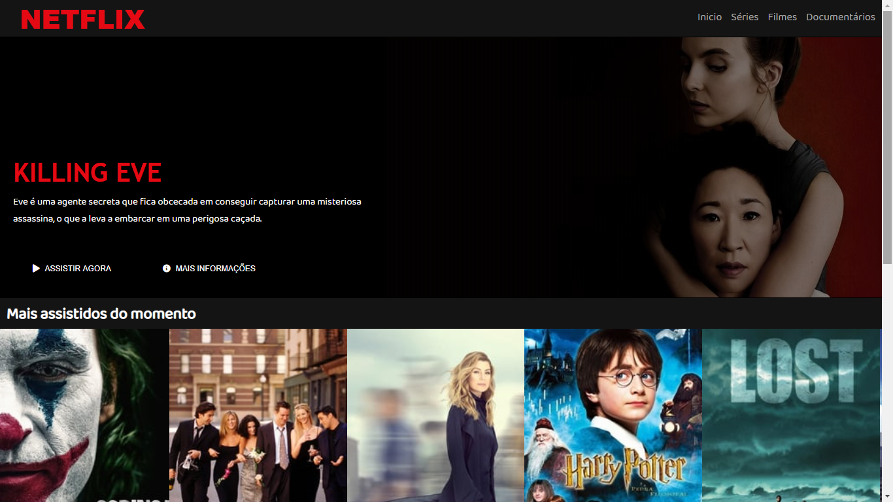
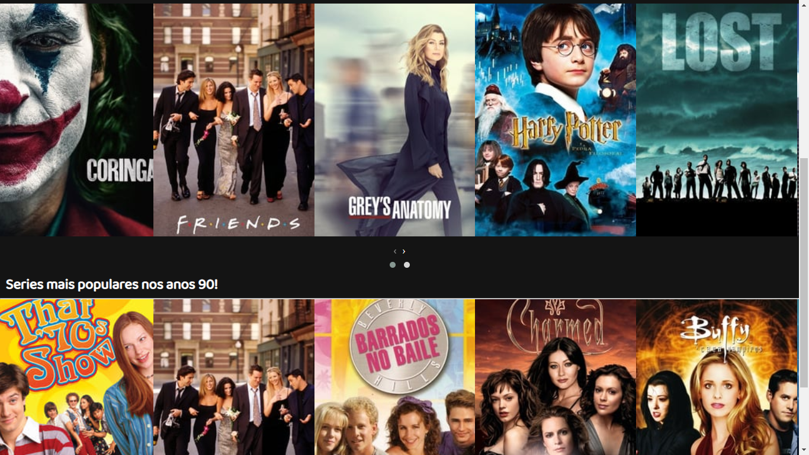

<h1 align="center">Netflix Clone</h1>

<h1>💻 Sobre o Projeto:</h1>
2ª tarefa prática do bootcamp Javascript Game Developer da Digital Innovation One. A premissa era recriar de maneira simplificada a página home da Netflix.

<h1>☑️ Tecnologias:</h1>
HTML5 e CSS3 puro  
Carrosel feito com
<a href="https://owlcarousel2.github.io/OwlCarousel2/">Owl Carousel</a>  
Icones retirados de 
<a href="https://fontawesome.com/">Font Awesome</a>
<h1>🎨 Layout</h1>

